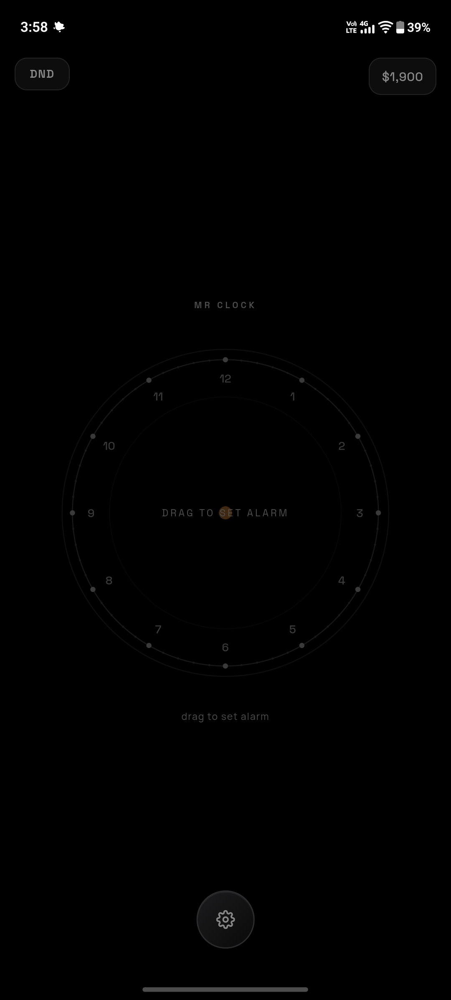
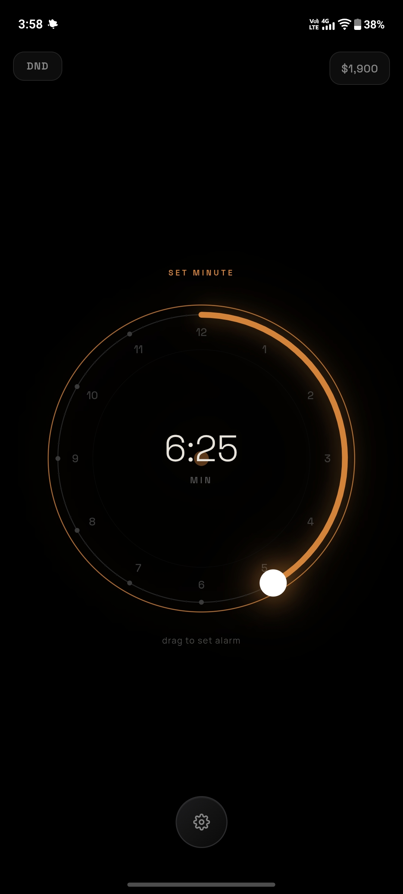
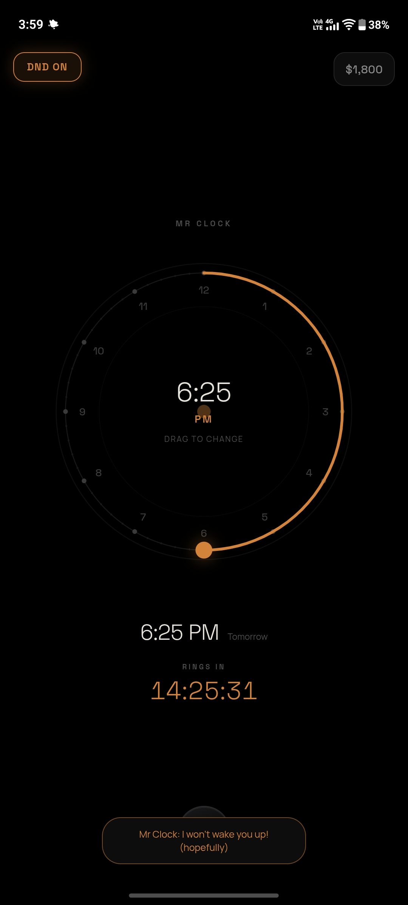

# Mr Clock 🎯

## Basic Details
### Team Name: AstroidDestroyer

### Team Members
- Team Lead: Sidharth Sreedhar K S - Sahrdaya Collage of Engineering and Technology
- Member 2: Niranjan Sabu - Sahrdaya Collage of Engineering and Technology

### Project Description
Alarm clock where you can set alarm but it doesnt guarantee that it will actually ring

### The Problem (that doesn't exist)
We all fail to keep sleeping while alarm turns on, through this we can pay some moeny to alarm clock so it wont ring and let us sleep peacefully. (it may betray you even if you bribe)

### The Solution (that nobody asked for)
An alarm clock that takes your bribe and stay silent instead waking you up and crush your dreams!

## Technical Details
### Technologies/Components Used
For Software:
- Languages Used
  html javascript and css

### Implementation
For Software:
# Installation
[commands]

# Run
[commands]

### Project Documentation
For Software:

# Screenshots (Add at least 3)

homescreen, drag clock to set hours first and then minute and then AM or PM
the button on bottom is holdable and it will let us choose options.

this is how you set alarm, drag the clock in the middle, on top of clock it will tell what youre setting on that drag, hour or minutes or AM/PM

this is what happen once you turn do not disturb or DND on

# Diagrams

*Add caption explaining your workflow*

For Hardware:

# Schematic & Circuit

*Add caption explaining connections*

*Add caption explaining the schematic*

# Build Photos

*List out all components shown*

*Explain the build steps*

*Explain the final build*

### Project Demo
# Video
[demo video](assets/demo_video.mp4)
*Explain what the video demonstrates*
its demo video, shows setting alarm and bribe, since we cant wait for actual alarm to ring, it shows demo, there are several ways alarm can ring, it depends on Mr Clocks mood. he may forget, or ring on time or delay it.
there shows some other settings too.

# Additional Demos
[Add any extra demo materials/links]

## Team Contributions
- Sidharth Sreedhar K S : Whole building part and idea
- Niranjan Sabu : Presentation

---
Made with ❤️ at TinkerHub Useless Projects 

